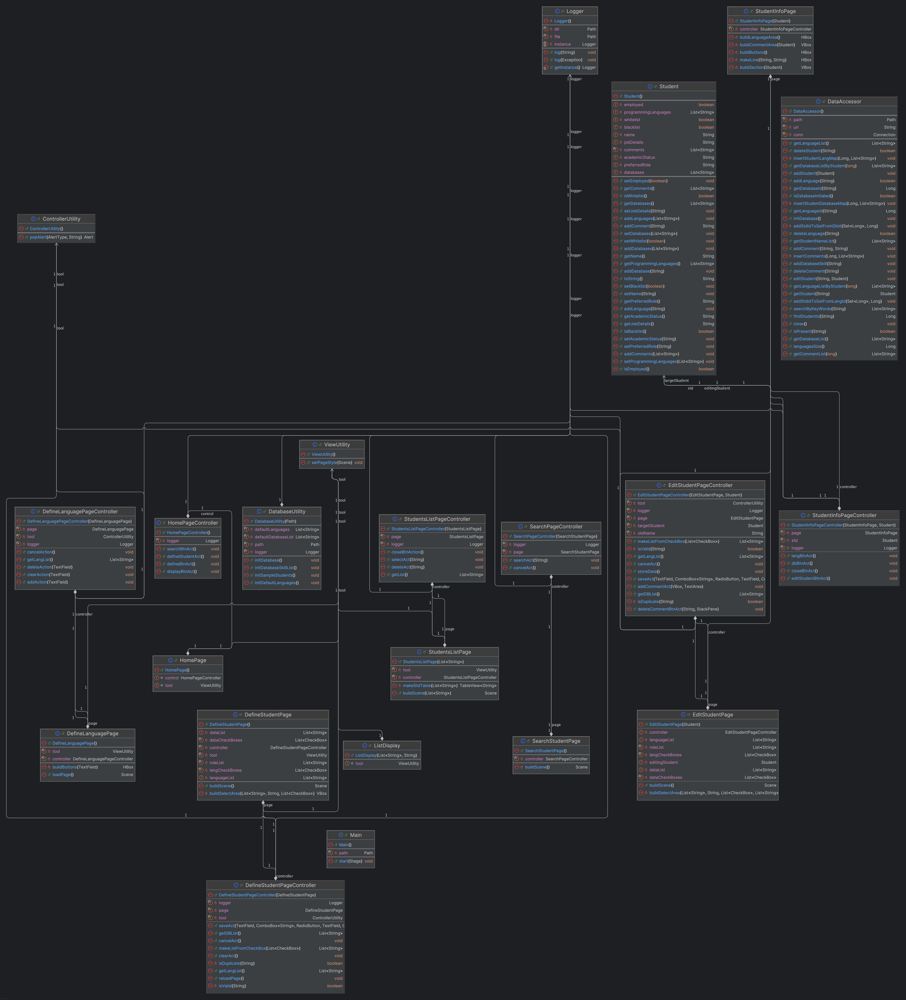

# CS151 Term Project - Version 0.7
## **Students' Knowledgebase for Faculties**

## Team Info
- **Team Number:** 21  
  - Julian Christian Simmons (Did what)
  - Ryan Monazzami (Did what)
  - Daniel Khant (Did what)
  - Jesse Yang (Did what)

---

## Project Description
This project is a desktop application designed for faculty members to record and manage students’ information such as programming skills, academic status, and evaluation notes.

## Version (**v0.7**)  
It focuses on implementing the **"Edit student"** page described in the project problem statement (Section 2.12).
Contribution:
  - Julian Christian Simmons (controller of edit page)  
  - Ryan Monazzami (data update behavoirs)  
  - Daniel Khant (UI/UX design)
  - Jesse Yang (edit page)

## Version (**v0.6**)
It focuses on implementing the **"Search for keywords"** page described in the project problem statement (Section 2.2).
Contribution:
  - Julian Christian Simmons (UI design, search bar design)  
  - Ryan Monazzami (searching behaviors)  
  - Daniel Khant (initialization of samples)
  - Jesse Yang (rebuild and data accessor implement)

## Version (**v0.5**)
It focuses on implementing the **"Define Student "** page described in the project problem statement (Section 2.2).
Contribution:
  - Julian Christian Simmons (UI design, sorting student method)  
  - Ryan Monazzami (addCommentPage and behaviors)  
  - Daniel Khant (Code documentation, testing, cleanup)
  - Jesse Yang (defineStudentPage)

## Version (**v0.4**)
It focuses on implementing **"All Programming Languages"** page as well as permanently storing the programming languages info entered.
  - Julian Christian Simmons (showProgrammingLangauges and bugs fixing)  
  - Ryan Monazzami (adding behaviors for student class)  
  - Daniel Khant (file IO system design)
  - Jesse Yang (data storing behaviors implement)
    
## Version (**v0.3**)
It focuses on implementing the **"Define Programming Languages"** page described in the project problem statement (Section 2.1.1, item 2).
Contribution:
  - Julian Christian Simmons (refine defineLanguagePage and bugs fixing)  
  - Ryan Monazzami (adding behaviors for student class)  
  - Daniel Khant (file IO system design)
  - Jesse Yang (data storing behaviors implement)

## Version (**v0.2**)
It focuses on implementing the **"Define Programming Languages"** page described in the project problem statement (Section 2.1.1, item 1).
Contribution:
  - Julian Christian Simmons (defineLanguagePage)  
  - Ryan Monazzami (studentListPage)  
  - Daniel Khant (StudentList dataStucture)
  - Jesse Yang (homepage)
    
---
## Technical Spec: 

- **Language:** Java 21  
- **Framework:** JavaFX  
- **Build Tool:** Maven  
- **JDK:** ZuluFX 21 (verified working under Zulu 23)  
- **Database:** SQLite
- **Database libary:** JDBC
- **Main Class:** `cs151.application.Main`
- **Style:** CSS

### UML



### Package Structure
```text
src/
└── main/
    ├── java/
    │   └── cs151/application/
    │       ├── controller/
    │       │   ├── EditPageController.java
    │       │   ├── DefineLanguagePageController.java
    │       │   ├── DefineStudentPageController.java
    │       │   ├── HomePageController.java
    │       │   ├── SearchPageController.java
    │       │   ├── StudentInfoPageController.java
    │       │   └── StudentsListPageController.java
    │       ├── model/
    │       │   └── Student.java
    │       ├── services/
    │       │   ├── ControllerUtility.java
    │       │   ├── DataAccessor.java
    │       │   ├── DatabaseUtility.java
    │       │   └── ViewUtility.java
    │       ├── view/
    │       │   ├── EditStudentPage.java
    │       │   ├── DefineLanguagePage.java
    │       │   ├── DefineStudentPage.java
    │       │   ├── HomePage.java
    │       │   ├── ListDisplay.java
    │       │   ├── SearchStudentPage.java
    │       │   ├── StudentInfoPage.java
    │       │   └── StudentsListPage.java
    │       ├── Main.java
    │       └── module-info.java
    ├── resources/
    │   └── img/
    │       ├── bg.png
    │       ├── inputBg.png
    │       └── sectionBg.png
    └── style/
        └── homePage.css
```  
---
## Functional Spec :

### Required features:

#### 1. Home Page
- Displays a welcome message.
- Provides a button to navigate to the **Define Programming Languages** page.

#### 2. Define Programming Languages Page
- Allows the user to input a programming language name (required field).  
- Input validation prevents blank submissions.  
- Sstores entered languages in memory or text/JSON file (for testing only, will be replaced by database).  
- Includes a Back button to return to the Home page.

#### 3. Student List Page
- Allows the user to check the list of all students.  
- There is a Information button allows use to check a student's information.  
- Includes a Back button to return to the Home page.

#### 4. Define Student page.
- Allows the user to check the a button and fill a form to define a student.  
- It will auto sorting the list after store in the studentList data file.

#### 5. Local Data Storing Feature
- A json file on local for storing all students' data.
- When the program is launched, program will load data from the json file. When add a student and close the program, that json file will be updated.
- Make sure the data will not be lost when close the program.

#### 6. Search Keywords Page.
- A search page allow users to enter keywords that they want to search.
- After click the search button, application will pop a result page with table view style to show all students that has the keywords.

#### 7. Comment Editing.
- Allows the user to view, add, and delete comments on a student's profile
- After clicking on a student's account, the application will provide an option to edit a student's profile and modify their comments.
  
---
